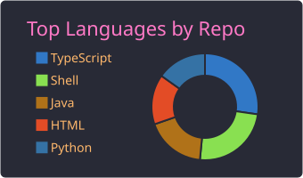

# Arturo Carrillo Jiménez

**Ingeniero de Software → Data Engineer**  
_Pipelines de datos a gran escala (AWS, Python, arquitecturas event-driven) | Backend en banca (Java, FastAPI) | Máster en Data Science e IA_  
_Almería, Andalucía, España_

[LinkedIn](https://www.linkedin.com/in/arturo-carrillo/) | [Email](mailto:acarrilloj05@gmail.com) | [GitHub](https://github.com/ArturoCarrilloJimenez)

---

> _"Para mí, 'funcionar' es el requisito mínimo. La verdadera meta es que la mantenibilidad, resiliencia y escalabilidad sean consecuencias naturales del diseño."_

 

<table>
  <tr>
    <td width="60%" valign="top">

### Sobre mí

- **Sistemas en Producción**: Software Developer en **Viewnext** (Proyecto Cajamar), desarrollando componentes críticos del sistema hipotecario, factoring... con foco en la integridad, disponibilidad y tratamiento de datos sensibles sanitizados bajo alta concurrencia.
- **Ingeniería de Datos**: Diseño de pipelines asíncronos y arquitecturas orientadas a eventos (FastAPI, AWS SQS/S3, Docker), optimizando ingesta masiva (+40.000 tareas/minuto) y almacenamiento en Data Lake (S3).
- **Formación Especializada**: Cursando Máster en _Data Science & Artificial Intelligence_ en **EBIS Business Techschool**.
- **Liderazgo Técnico en IA**: Impartición de talleres y divulgación interna sobre arquitecturas de **Agentes de IA y protocolo MCP** (reconocido en el boletín mensual de la empresa).
- **Ubicación**: Almería, Andalucía, España _(disponible para remoto y con movilidad geográfica)_.

    </td>
    <td width="40%" align="center" valign="middle">
      
    </td>
    </tr>
  </table>

---

### 🚀 Sistemas en Producción & Proyectos de Arquitectura

#### 1. [Pipeline de Ingesta y Procesamiento a Gran Escala (WebScrapingDistributed)](https://github.com/ArturoCarrilloJimenez/WebScrapingDistributed)
*Arquitectura distribuida de ingesta masiva y extracción asíncrona orientada a eventos.*

- **Ingesta de Alta Concurrencia:** Endpoint asíncrono en **FastAPI** con validación estricta de esquemas (Pydantic), capaz de ingerir y despachar **+40.000 tareas/minuto** hacia colas **Amazon SQS** con latencias de encolado <70 ms>.
- **Cómputo Multinivel (*Tiered Execution*):** Desacoplamiento de la carga de trabajo según el destino:
  - *Pipeline Estático:* Clientes HTTP asíncronos para scraping masivo de bajísima latencia y mínimo consumo de memoria.
  - *Pipeline Dinámico:* Pool elástico de workers en contenedores (**Playwright**/Python) para renderizado complejo de DOM y SPAs.
- **Escalado Reactivo (K8s + KEDA):** Autoscaling horizontal de pods en Kubernetes conducido directamente por la profundidad de la cola SQS (*queue lag*), escalando dinámicamente de 0 a $N$ workers según la demanda.
- **Data Lake Storage (AWS S3):** Capa de buffer en memoria con volcados compactados por lotes para solucionar el *Small Files Problem* y reducir radicalmente los costes operativos de I/O en S3].

#### 2. [StyleHub - Backend Transaccional](https://github.com/ArturoCarrilloJimenez/StyleHub-Backend-Nest)
*API REST modular orientada a dominio para comercio electrónico.*
- **Arquitectura Limpia & Modular:** Backend construido con **NestJS** y TypeScript estructurado bajo principios SOLID, separación estricta por módulos de dominio y control de acceso basado en roles (RBAC) con JWT.
- **Transaccionalidad & Consistencia Financiera:** Procesamiento idempotente de pagos mediante integración segura de webhooks con **Stripe** para prevenir duplicidades en eventos asíncronos y persistencia relacional en **PostgreSQL**.
- **Containerización:** Entorno completamente dockerizado para desarrollo y despliegue, asegurando paridad local/producción.

#### 3. [Photo Josma](https://photojosma.com) *(Plataforma Comercial en Producción — Código Propietario)*
*Sistema comercial en producción con motor de tarificación logística dinámica.*
- **Motor Geoespacial Multi-Hub:** Microservicio desacoplado en **Express.js** (24/7) que alimenta el presupuestador interactivo ([/calcular-presupuesto](https://photojosma.com/calcular-presupuesto)). Resuelve en tiempo real la distancia euclídea/vial contra dos nodos logísticos estratégicos (Almería y Purullena), aplicando automáticamente la ruta de coste mínimo (€0,50/km ida y vuelta) y emitiendo el presupuesto transaccional por email.
- **Rendimiento Web Extremo:** Arquitectura frontend optimizada para catálogos intensivos en imágenes, logrando auditorías Lighthouse y métricas **Core Web Vitals >90%** en velocidad y SEO técnico.
- **Impacto en Negocio:** Implementación de analítica avanzada y optimización técnica de embudo, generando en el primer mes un **+40% de tráfico orgánico cualificado** y captación directa de clientes.
---

### Tecnologías y Herramientas

#### Datos, Cloud & Pipelines

  
  
  
  
  
  
  

> Python · PySpark · Pandas · NumPy · Scikit-Learn · AWS (SQS, S3, EC2) · K8s (KEDA) · Arquitecturas Event-Driven · Docker · Diseño de DFD

#### Backend & Arquitectura Distribuida

  
  
  
  
  

> FastAPI · NestJS · Java · TypeScript · Node.js / Express · RESTful APIs · Clean Architecture · DDD

#### Persistencia & Almacenamiento

  
  
  

> PostgreSQL · MySQL · Supabase · SQL avanzado (optimización de consultas, planes de ejecución, índices) · AWS S3 (Data Lake)

#### DevOps, Calidad & Testing

  
  

<<<<<<< HEAD
> GitHub Actions (CI/CD) · SonarQube · Pytest · Docker Compose · Git / GitHub Flow
=======
- **Viewnext (Proyecto Cajamar)** — *Software Developer*
  - Desarrollo de funcionalidades e interfaces en Java y JavaScript para los módulos Hipotecario y Factoring en entorno regulado bancario (Scrum).
  - Creación de contenidos y talleres internos para la adopción de IA Generativa en la delegación regional.
- **Viewnext** — *Full Stack Developer*
  - Desarrollo web con Angular, NestJS, Node.js, Stripe, Docker, GitHub Actions y Prompt Engineering para agentes de IA corporativos.
- **Web Scraping Distributed**:
  - Diseño de sistemas de scraping masivo distribuidos utilizando AWS SQS enfocados en alta disponibilidad.
>>>>>>> b982997177067deb186e71b2b2326276c3cd2126

---

### Estadísticas de GitHub

  
  

---

### Contacto

- **Email**: [acarrilloj05@gmail.com](mailto:acarrilloj05@gmail.com)
- **LinkedIn**: [linkedin.com/in/arturo-carrillo](https://www.linkedin.com/in/arturo-carrillo/)
